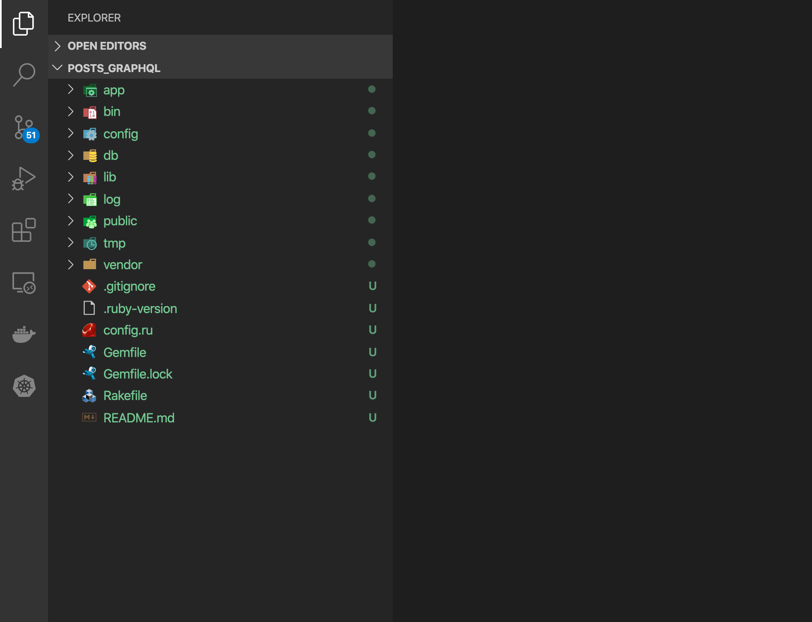
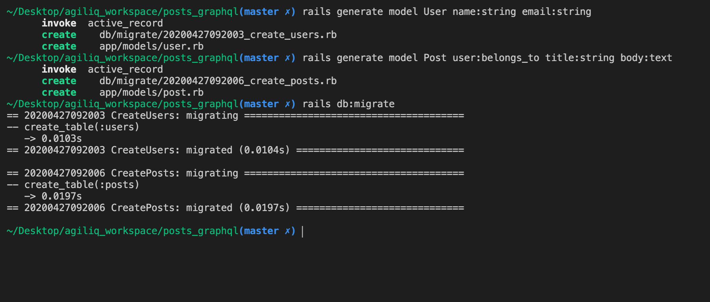
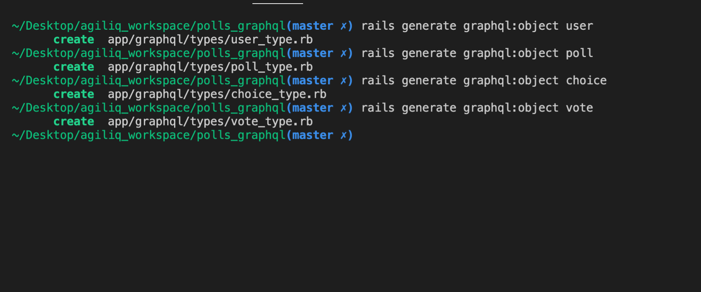
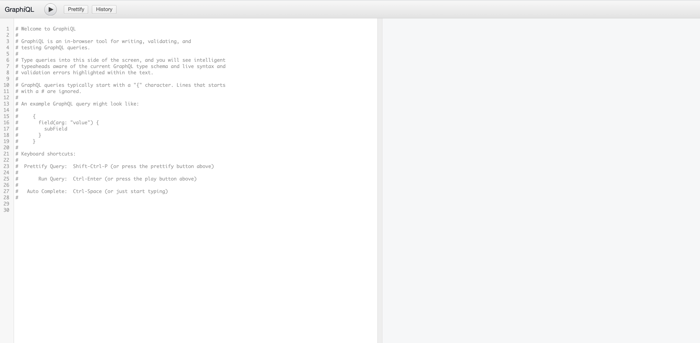
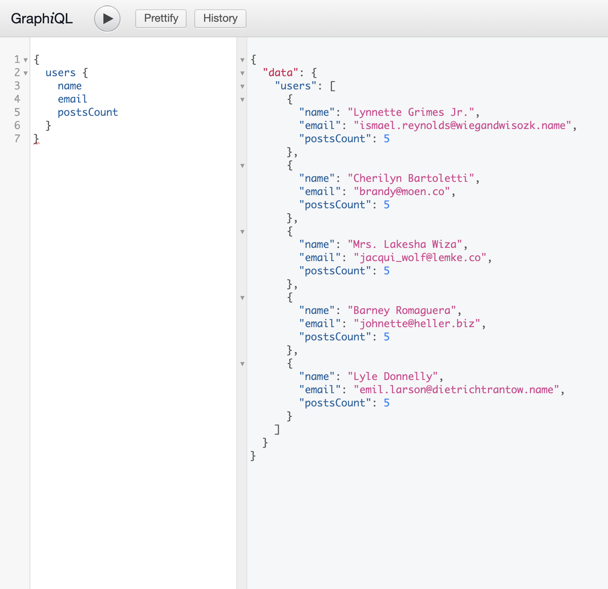
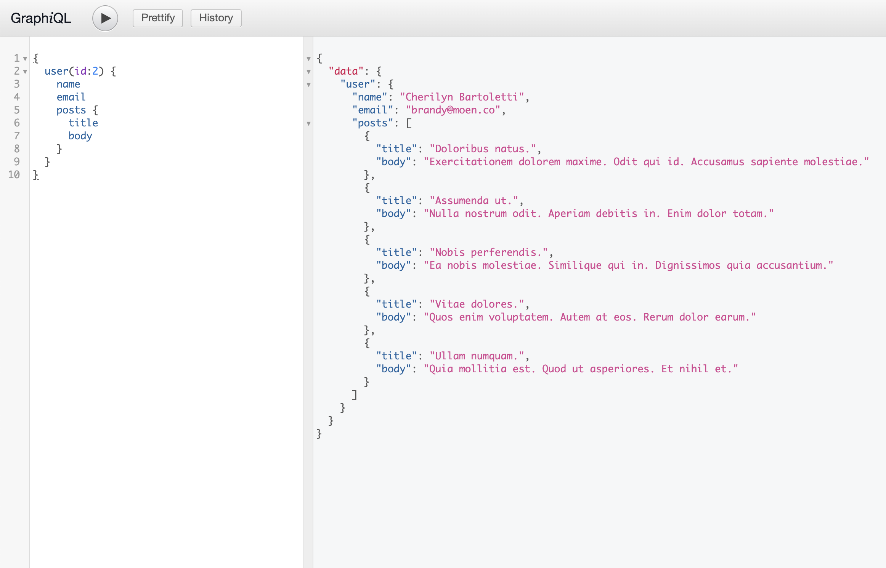

# Running a Rails server with GraphQL and GraphiQL
This tutorial gives a brief to understand how to build a Rails backend server with GraphQL integration. Since there's no frontend involved, we'll be using GraphiQL to make the requests to our server.

### Why Ruby?
Ruby is a very high level language, which means Ruby abstracts away (i.e. handles for you) most of the complex details of the machine. Thus, you can quickly build something from scratch with less lines of code. Ruby was made popular by the Ruby on Rails framework, a full-stack web framework that makes prototyping a breeze, making it a web framework of choice for many startups and coding beginners alike.

Reasons why one should learn ruby:
1. Beginner Friendliness
2. Has a wide community for support
4. One more backend development tool to the resume! and many more!!

## Setup
The aim of this project is to build a basic Posts API where we have a user adding particular posts, using Rails and GraphQL.

```sh
# Installing ruby
# To keep control of which version of Ruby we're using, I'd recommend using rvm
# RVM setup has been documented here --> https://rvm.io/rvm/install
rvm install 2.6.5

# Installing rails globally
# Just like we do in node, we need to install rails globally once
gem install rails
```

Now that we have rails installed and setup, lets setup our project

## Getting Started with Rails

```sh
# Generate code for a sample project
rails new posts_graphql -d postgresql --api --skip-tests --skip-action-mailbox --skip-action-text --skip-spring -T --skip-turbolinks --skip-active-storage

# Explaining the parameters passed
#   -d              --->        Specify the database being used, in our case postgresql.
#                               Options include sqlite3, mysql, etc
#   --api           --->        For API only apps, we don't need to load frontend modules.
#   --sktip-NAME    --->        This option is used to skip a particular module
#                               which come by default when generating a rails application
# Here we are skipping the modules --> tests, action-inbox, action-text, turbolinks and active-storage,
# as we won't be using them in the project
# 
```


Navigate to `config/database.yml` and fill the appropriate values pertaining to username, password etc. as they're used to connect to the database

```yml
# Example
development:
  <<: *default
  database: rails_posts_db

  # The specified database role being used to connect to postgres.
  # To create additional roles in postgres see `$ createuser --help`.
  # When left blank, postgres will use the default role. This is
  # the same name as the operating system user that initialized the database.
  username: rails_posts_user

  # The password associated with the postgres role (username).
  password: rails_posts_password

  # Connect on a TCP socket. Omitted by default since the client uses a
  # domain socket that doesn't need configuration. Windows does not have
  # domain sockets, so uncomment these lines.
  host: localhost

  # The TCP port the server listens on. Defaults to 5432.
  # If your server runs on a different port number, change accordingly.
  port: 5432
```

Now that we're connected to the database and generated a sample project lets generate models for the same. The key thing is, even though we'll be using GraphQL, we'll still use the models generated by rails.

```sh
# Generating models
# Generating User model with fields 
#    `name`       : datatype -> string
#    `email`      : datatype -> string
rails generate model User name:string email:string

# Generating Post model with fields 
#    `user`       : datatype -> User
#    `title`       : datatype -> string
#    `body`       : datatype -> text
rails generate model Post user:belongs_to title:string body:text

```

Now that we have the models setup, lets run the migrations. To run migrations, run the command `rails db:migrate`



Now lets naviagate to `app/models`. Inside this folder, we should be seeing four newly created files, `user.rb` and `post.rb`.

For a Posting System, we know that, 
```sh
# Post      ->  belongs to      -> User

# We need to define the relationships
# User      ->  can have many   -> Posts
```

So lets go to `user.rb` to update the code accordingly (as the second part i.e. `User -> can have many -> posts` was not auto generated)

```rb
# user.rb
class User < ApplicationRecord
    has_many :posts
end
```

Now that we're all set, lets install GraphQL and GraphiQL. We can do this simply by adding their respective gems to the `Gemfile`. We're also going to install `Faker` gem to pre-populate/seed the database with sample values

```
gem 'graphql'

group :development do
  # Any existing code
  gem 'graphiql-rails'
  gem 'faker'
end
```

Once the `Gemfile` is modified, just run the command `bundle install` in the root directory of the project to install any missing gems. Now that we're done with installation, lets seed some data. Update the `seeds.rb` as below

```rb
# seeds.rb
# We're using Faker to generate random emails, for testing purposes
5.times do
    user = User.create(name: Faker::Name.name, email: Faker::Internet.email)
    5.times do
        user.posts.create(title: Faker::Lorem.sentence(word_count: 2), body: Faker::Lorem.paragraph(sentence_count: 3))
    end
end
```
Lets then run the command `rails db:seed`. If nothing is shown as output, it means the command has executed successfully. Now that we have the data, lets start using graphql

## Generating GraphQL Code

Remember we had installed the gems for GraphQL and GraphiQL. Lets setup the GraphQL installation now.

```sh
# Setting up GraphQL code in our project
# Note: Only works if GraphQL gem is pre-installed 
# (we did it earlier when running `bundle install`)
rails generate graphql:install
```
Note that this command is very handy and auto-generates a lot of code for us. After running this command, we can see a new folder `graphql` has been created in the `app` directory. Also, `config/routes.rb` has also been automatically updated with the default graphql endpoint, which we'll be using to mutate and list the data in our database.

With that installed, we have to configure our Rails models as GraphQL Objects. This can be done as another generation.
```sh
rails generate
# ...
# Graphql:
#   graphql:enum
#   graphql:install
#   graphql:interface
#   graphql:loader              
#   graphql:mutation
#   graphql:object          <========= This is what we need to run
#   graphql:scalar
#   graphql:union

# TestUnit:
#   test_unit:channel
#   test_unit:controller
#   test_unit:generator
#   test_unit:helper
# ...

# We need to run the command mentioned above for each model. So,
rails generate graphql:object user
rails generate graphql:object post
```



With that install we should be set to building queries but we need a way to visualize it and probably do a little more easily. That's where the second gem `graphiql-rails` comes in which we added in the beginning. Its just a GUI interface which will help us run GraphQL queries

Now lets update the routes file with the `GraphiQL GUI` endpoint
```rb
# routes.rb
Rails.application.routes.draw do
  if Rails.env.development?
    mount GraphiQL::Rails::Engine, at: 'graphiql', graphql_path: "graphql#execute"
  end

  post "/graphql", to: "graphql#execute"
end
```

### Tweaking GraphiQL Installation
`Note`: Sometimes the `sprockets` engine isn't enabled, and because of that, even after starting the rails server and navigating to the [graphql page](http://localhost:5000/graphiql) shows `Loading...`. To solve this issue, run the steps below:

1. Enable `sprockets`
```rb
# config/application.rb
# ... Some code ...
require "action_cable/engine"
require "sprockets/railtie" # This was commented, so uncomment it
# ... Some code ...
```

2. Create a new file `manifest.js` inside the folder `app/assets/config` with contents
```js
//= link graphiql/rails/application.css
//= link graphiql/rails/application.js
```

3. Start the Rails server
```
rails s --port 5000
```

Once this is done, we should be able to open the [graphiql page](http://localhost:5000/graphiql)



## Building GraphQL Query

If it were just a Rails application, we'd have added code to the `controller.rb` file. But remember that since this is a GraphQL project, we will have a single endpoint serving all over data. So lets start modifying the `_type.rb` files which were generated earlier.

These files will act like the models/schema for the GraphQL Application

```rb
# user_type.rb
module Types
  class UserType < Types::BaseObject
    field :id, ID, null: false
    field :name, String, null: true
    field :email, String, null: true
    field :posts, [Types::PostType], null: true
    field :posts_count, Integer, null: true

    # Typical rails method returning the count
    # of total posts for each user
    def posts_count
      object.posts.size
    end
  end
end
```

```rb
# posts_type.rb
module Types
  class PostType < Types::BaseObject
    field :id, Integer, null: false
    field :title, String, null: false
    field :body, String, null: false
  end
end
```

Lets add queries as well. For this, update the file `query_type.rb`
```rb
# Define all the queries in the project
module Types
  class QueryType < Types::BaseObject
    # 1 - Adding users
    field :users, [Types::UserType], null: false

    # 1.1 Users Query
    def users
      User.all
    end

    # 2 - Adding one user
    field :user, Types::UserType, null: false do
      # Passing arguemts used to identify user
      argument :id, ID, required: true
    end

    # 2.1 - User Query
    def user(id:)
      User.find(id)
    end
  end
end
```

Now lets goto our [graphiql page](localhost:5000/graphiql) and type the query below
```
{
  users {
    name
    email
    postsCount
  }
}
```



You can also try adding `posts` with `title` and/or `body` parameters to the query and test it out
```
{
  user(id:2) {
    name
    email
    posts {
      title
      body
    }
  }
}
```



Now that we're done with querying, lets start creating/modifying the data

## Building GraphQL Mutations
Mutations is essentially creating or modifying the data in GraphQL. Lets go over to the `graphql/mutations`. Make sure you have a file called `base_mutations.rb`. In case if its not auto generated, just use the code below (found it in Ruby GraphQL Docs)
```rb
# base_mutation.rb 
module Mutations
  class BaseMutation < GraphQL::Schema::RelayClassicMutation
    argument_class Types::BaseArgument
    field_class Types::BaseField
    input_object_class Types::BaseInputObject
    object_class Types::BaseObject
  end
end
```

Now, for our users model, we want to have our own custom mutation. Lets create a new file `create_user.rb` which handles this action.
```rb
# create_user.rb
class Mutations::CreateUser < Mutations::BaseMutation
    # accepting arguments
    argument :name, String, required: true
    argument :email, String, required: true

    # Fields to return after object creation
    field :user, Types::UserType, null: false
    field :errors, [String], null: false

    # # The magic resolve method
    # Its not any magic but when we have arguments specified,
    # we need to override this method with the arguments as params,
    # after which we run operations like saving,etc
    def resolve(name:, email:)
        user = User.new(name: name, email: email)
        if user.save
            {
                user: user,
                errors: []
            }
        else
            {
                user: nil,
                errors: users.errors.full_messages
            }
        end
    end
end
```

Now that we have created our custom mutation, we need to link it to GraphQL. To do that, go to `graphql/types/mutation_type.rb` and add the field `create_user` with custom mutation `CreateUser`. 
```rb
# mutation_type.rb
module Types
  class MutationType < Types::BaseObject
    # Field and mutation type
    field :create_user, mutation: Mutations::CreateUser
  end
end
```

Now lets run the create user query
```
mutation {
  createUser(input: {name: "Yadavalli Santosh", email: "santosh@gmail.com"}) {
    user {
      id
      name
      email
      posts {
        
      }
    }
    errors
  }
}
```

Similar to the mutation above, please refer to `update_user.rb` and `delete_user.rb` which are mutations for updating & deleting users respectively.

The query to update users:
```
mutation {
  updateUser(input: {id: 6, name: "Iron Man"}) {
    user {
      id
      name
      email
    }
    errors
  }
}
```
The query to delete users:
```
mutation {
  deleteUser(input: {id: 7}) {
    user {
      id
      name
      email
    }
    errors
  }
}
```